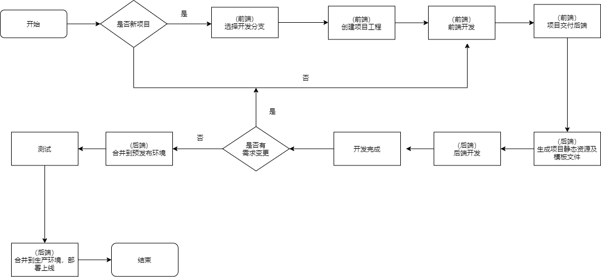
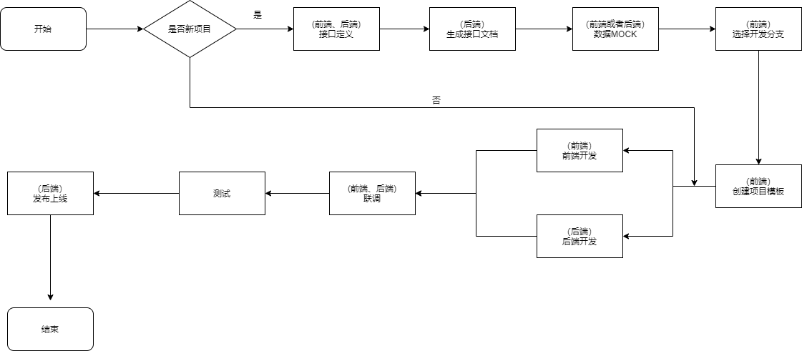

# IGG 通用项目前后端配合流程说明

## 流程介绍

在新的工作流中，分为前后端不分离模式和前后端分离模式。

- 不分离模式：前端人员在**项目仓库中**开发活动，开发完成后告知后端人员开发目录路径，后端人员执行 `yarn build:dev` 生成模板文件，复制对应模板文件作为程序 html 模板进行开发，若前端模板文件结构有调整，需要前后端人员配合完成程序模板调整，直至开发完成部署上线;
- 分离模式：前端人员在**项目仓库中**开发活动，后端提供接口给前端使用，开发完成后进行联调，直至完成开发部署上线。此开发流程中后端人员不需要关注模板文件;

与旧工作流程相比，新流程主要有以下几点不同：

1. 前端工程源码存放于项目仓库;
2. 静态资源由发布系统编译并发布;
3. 交付给后端的模板由后端人员编译得到;
4. 后端人员在本地开发时静态资源读取的是本地文件;

相对旧工作流程，新工作流有以下优点：

1. 在前后端分离模式中，后端人员完全不需要关注模板和静态资源;
2. 自动更新客户端缓存, 文件名哈希值根据文件内容生成;
3. 多语言图片嵌入优化;

## 必备工具

- nodejs

  推荐版本：`v12.22.1`。  
  下载地址：[https://nodejs.org/dist/latest-v12.x/node-v12.22.1-x64.msi](https://nodejs.org/dist/latest-v12.x/node-v12.22.1-x64.msi)。  
  安装后设置 npm 源为淘宝镜像可以加快安装速度：

  ```
  npm config set registry https://registry.npm.taobao.org
  ```

  另外，需要配置 `@igg` 前缀的包的 `registry` 为内网私有库地址：

  ```
  npm config set @igg:registry http://fe.skyunion.net:8081
  ```

  之后，在非前端后分离项目中，后端人员将使用 `node` 编译前端工程以得到项目模板文件和本地开发需要的静态资源文件。

- 包管理工具 Yarn

  推荐版本：`latest`。  
  安装方法：  
  在安装完 `nodejs` 后，在命令行输入：

  ```
  npm i -g yarn
  ```

- IGG Cli (仅前端开发人员需要安装)  
  IGG Cli 用于创建非前后端分离的项目， 项目地址： [http://fe.skyunion.net:8081/-/web/detail/@igg/cli](http://fe.skyunion.net:8081/-/web/detail/@igg/cli)。  
   安装方法：  
   全局安装, 安装完成后命令行会有一个名为 `igg` 的全局命令：

  ```
  npm i -g @igg/cli
  ```

- Vue Cli 的 IGG 活动插件（仅前端开发人员需要安装）  
  此插件用于创建前后端分离的项目, 项目地址： [http://fe.skyunion.net:8081/-/web/detail/@igg/vue-cli-plugin-igg-event](http://fe.skyunion.net:8081/-/web/detail/@igg/vue-cli-plugin-igg-event)  
  使用方法：

  1. 安装 `Vue Cli`:

  ```
  npm i -g @vue/cli
  ```

  2. 使用 `Vue Cli` 创建项目:

  ```
  vue create demo-event
  ```

  3. 项目创建完成后，再添加此插件:

  ```
  vue add @igg/vue-cli-plugin-igg-event
  ```

## PHP SDK

## PHP SDK 包地址

[https://git.skyunion.net/frontend/frontend-sdk](https://git.skyunion.net/frontend/frontend-sdk)

### PHP SDK 基本用法

更详细的用法可以去 git 仓库查看 readme 文档

```
use IGG\Frontend\Template;

// 本地开发时，需要声明一个常量，这个时候会直接加载本地文件
define('ASSETS_DEV', TRUE);

// 站点根目录绝对路径
$rootPath = dirname(dirname(__DIR__));

// 传入活动前端资源映射assets.json所在目录，存放在站点根目录/assets-maps下，由前端组脚本生成
Template::instance($rootPath, array('events/2021/test-event/', 'events/2021/test/'));

// 获得一个无语言区分的文件公网地址
staticFile('events/2021/test-event/css/mobile/index.css');

// 获得英文资源文件公网地址
staticFile('events/2021/test-event/img/1.png', 'eng');

// 假如资源是多语言的，但是未传语言，则默认取配置第一张图片做为地址返回
staticFile('events/2021/test-event/img/1.png');

// 方法默认直接输出，不需要输出则使用第三个参数传0
staticFile('events/2021/test-event/img/1.png', '', 0);
```

## 目录规范

### 前端工程源码存放目录规范

当前端工程存放于项目仓库时，应按以下目录规则存放：

```
├── frontend                            【进版本库】前端工程源码
|  └── events                           活动目录
|     └── 2021                          活动年份
|        └── demo-event                 活动名
|           └── dist                    打包目录
|           └── jenkins.config.json     jenkins配置文件, 由脚手架自动生成
|           └── package.json            项目配置文件
└── demo-project                        非活动项目
|  └── dist
|  └── jenkins.config.json
|  └── package.json
└── auto-assets                         【不进版本库】用于本地开发的静态资源目录，由前端脚手架生成, 细节见后面操作流程（如站点web root指向在代码根目录)
└── assets-maps                         【进版本库】静态资源文件名映射JSON文件，由前端脚手架生成, 细节见后面操作流程
└── public                              * 如果web root为public时，项目根目录会存在这个文件夹
|  └── auto-assets                      * 【不进版本库】功能同根目录的auto-assets/, 如站点web root是在public目录下，则这个目录会自动生成到此处
```

- 案例 1：SUS 游戏开发一个圣诞节活动  
  前端源码应存放于 `sus.igg.com` 仓库中的 `frontend/events/2021/xmas` 目录下。
- 案例 2：开发 TP 游戏官网首页  
  前端源码应存放于 `dut.igg.com` 仓库中的 `frontend/homepage` 目录下。

### 静态资源发布目录规范

静态资源发布在 `//statics.igg.com/assets/` 路径下。

#### 上传方式

上传方式有以下两种：

1. 项目仓库内的前端工程源码，合并到 `pre` 或者 `master` 分支时，由发布系统编译并上传;
2. 提交到 `gitlab` 仓库 `project-assets` 的文件，会由发布系统全量发布到对应路径下;

#### 路径规则

静态资源路径应遵循以下规则：

1. 各游戏（项目）以游戏名(项目名)（优先取二级域名）建立在 `assets` 下， 例如 `sus` 的路径为: `/assets/sus`， 运营支撑系统为 `/assets/support`, 公共库文件为 `/assets/lib`。
2. 若项目为游戏，为区分以上两种上传方式，需要在游戏名下级建立 `dist` 和 `res` 目录，其中，通过项目仓库编译的资源目录为`dist` , 通过 `project-assets` 仓库上传的资源目录为 `res`。
3. 活动需要按年份分类, 存放于 `events` 目录中, 如: `/assets/sus/res/events/2021/demo-event`。
4. 目录及文件名为小写英文、数字及半角英文 `-`。
5. 目录名如为二个或以上单词用单横线-连接, 如 `/assets/sus/events/2021/test-event`。

以下是目录结构示例：

```
├── assets                                  根路径
|  └── lib                                  一级目录以项目名为目录名
|     └── jquery
|     └── vue
|  └── lo                                   一级目录
|     └── dist                              dist 为项目仓库内编译的静态资源
|           └── demo-project                非活动项目
|               └── css                     css
|               └── img                     img
|               └── js                      js
|           └── events                      活动项目
|               └── 2021                    活动年份
|                   └── demo-event          活动，以活动名为目录名
|                       └── css
|                       └── js
|                       └── img
|     └── res                               res 为通过 project-assets 仓库上传的资源目录
|           └── demo-project                非活动项目
|               └── css
|               └── img
|               └── js
|           └── events                      活动项目
|               └── 2021                    活动年份
|                   └── demo-event          活动，以活动名为目录名
|                       └── css
|                       └── js
|                       └── img

```

**注意**： 从属于游戏的活动或者非活动资源，需要放在 `dist` 或者 `res` 路径下，以区分编译资源和直接上传的资源。  
资源应在哪个路径下，一个简单的判断规则是，如果你的资源是集成在活动仓库内，应在 `dist` 目录下，如果在 `project-assets` 仓库内，则应在 `res` 目录下。

## 开发流程细节

### 前后端不分离模式

#### 流程图



#### 前端开发人员流程

1. 选择开发分支  
   在与后端开发人员约定好的分支进行开发。

2. 建立项目工程  
   通过 `IGG Cli` 的 `create` 命令创建项目模板, 工程目录应遵循前述 _前端工程源码存放目录规范_, 在开发目录下的命令行输入：

   ```
    igg create demo-event
   ```

   之后，项目脚手架将通过问答进行项目配置，具体配置及解释如下：

   1. 活动名称（eventName）  
      输入项目的活动名称，需要为英文、数字和英文连接符 `-` , 此项必填。
   2. 输入发布路径（publicPath）  
      输入项目静态资源发布路径，即按以上静态资源目录规范，本项目的静态资源应发布在何路径下，之后，Cli 工具将会替换项目模板相关变量。  
      **注意：** 路径名中需要包含 `dist`。
   3. 选择 web 路径（webPath）  
      web 路径有两种，一种为项目根目录，一种为项目 `public` 目录，各项目不同，请咨询该项目后端开发人员。  
      此配置将写入打包生成的静态资源映射文件中(即 `assets-map` 目录对应的 `assets.json` 文件)。
   4. 选择需要的模块（modules）  
      目前，有四个预置公共库可供选择，`jQuery`, `vue`, `axios` 和 `vant`。
   5. 活动平台类型/主题（eventType）  
      此配置有四个选项， 请根据项目情况选择：
      - PC
      - Mobile
      - PC & Mobile
      - 自定义名称
   6. 输入主题名（themeName）  
      主题目录名，当上一配置选择`自定义名称`时，需要填写此配置。

3. 前端开发阶段  
   前端开发人员进行页面制作及表现类功能的 JS 编写。
4. 项目交付  
   当完成前端开发后且提交代码后，将前端源码路径告知后端开发人员即完成交付。

#### 后端开发人员流程

1. 生成本地静态资源文件及模板文件  
   在前端开发完成得到前端源代码目录路径时，在前端源代码目录下，运行：

   ```
   // 1. 安装项目依赖包
   yarn

   // 2. 生成静态资源
   yarn build:dev
   ```

   此时，会生成两类文件，分别是：

   - 静态资源文件及模板文件  
     静态资源文件用于本地开发，生成在仓库根目录的 `/auto-assets/` 路径下(web root 为 public 时，这个目录会生成到/public/auto-assets/),
     如前端源码目录为 `frontend/events/2021/demo-event` , 则此项目的本地静态资源文件在 `/auto-assets/events/2021/demo-event` 中。
     模板文件位于 `/auto-assets/events/2021/demo-event/pages` 文件夹中, 该文件夹内有 `.html` 和对应的 `.phtml` 文件，请将 `.phtml` 文件拷贝至活动正式的模板目录中。

   - 静态资源映射文件  
     因生成的静态资源是根据文件内容生成哈希值在文件名上，所以当文件内容变化时，文件名也会产生变化，因此，在每次前端工程编译时，会根据静态资源的文件名， 在仓库根目录的 `/assets-map/` 路径下生成一份静态资源映射文件。  
     如前端源码目录为 `frontend/events/2021/demo-event` , 则此项目的映射文件在 `/assets-map/events/2021/demo-event` 中。  
     在模板文件中，插入的是文件的键名，如`<?php staticFile('events/2021/test-event/css/mobile/index.css') ?>`, `PHP SDK` 根据键名及环境，在静态资源映射文件中找到对应的静态资源并插入。  
     文件内容示例如下：

     ```
      {
        "publicPath": "//statics.igg.com/assets/sus/dist/events/2021/test-event/", // 该项目发布路径
        "webPath": "/", // 本项目仓库的web路径
        "assets": {
          "events/2021/test-event/css/mobile/index.css": "css/mobile/index.7839da06.css", // 文件映射
          "events/2021/test-event/img/1.png": { "chs": "img/1--chs.cdbc815d.png", "eng": "img/1--eng.cdbc815d.png" } // 多语言图片的文件映射
        }
      }
     ```

2. 获得模板文件
   在对应目录找到 index.phtml 文件，复制到程序自己的模板目录内进行开发

3. 后端开发阶段
   业务开发...

4. 模板变更
   假如在开发过程中需求变动、逻辑优化等原因，模板发生变动，在前端提交代码后，开发可以拉取最新的前端代码，然后重新执行步骤 1。与前端同学一起将 dom 变动改到程序模板上。

5. 发布上线

### 前后端分离模式

#### 流程图



#### 前端开发人员流程

1. 选择开发分支  
   请按与后端开发人员约定好的分支进行开发。
2. 接口定义  
   应对页面功能进行分析，并配合后端开发人员页面用到的接口及字段进行定义，最终由后端开发人员提供接口文档给前端。
3. 数据 MOCK  
   根据接口文档，在 [YAPI](http://fe.skyunion.net:8082/) 上做数据 MOCK。
4. 建立项目工程  
   通过 `Vue Cli` 及 `vue-cli-plugin-igg-event` 创建工程, 工程目录应遵循`前端工程源码存放目录规范`：

   1. 通过 `Vue Cli` 创建项目

   ```
   vue create demo-event
   ```

   1. 添加 `vue-cli-plugin-igg-event` 插件

   ```
   vue add @igg/vue-cli-plugin-igg-event
   ```

   此时，插件通过问答进行项目配置，配置及解释与上述非前后端分离开发流程中使用 `IGG Cli` 创建项目中的问答一致的部分此处不再赘述。  
   不同的是，此流程需要额外配置模板的存放路径，即编译后的模板文件应存放于哪个目录下。

5. 前端开发阶段  
   进行页面制作及功能开发。
6. 联调阶段  
   将接口域名设置为后端提供的地址，进行联调。

#### 后端开发人员流程

1. 接口定义  
   与前端开发人员配合分析页面功能及定义接口及字段，并提供接口文档。
2. 后端开发阶段
3. 联调阶段  
   与前端开发人员配合进行接口联调。

### 项目发布

将开发分支合并到预发布环境(分支名必须为 pre)或者生产环境(分支名必须为 master)并执行手动或者自动发布, 发布系统检测到前端工程文件发生变化，将根据当前分支，如为 `pre` 则执行 `npm build:pre` 命令，如为 `master` 分支则执行`npm build` 命令，之后将编译后的静态资源文件上传到 `statics.igg.com` , 完成发布。

### .gitignore 的修改

项目的.gitignore 文件需增加以下几条，以排除前端项目中不需要提交的文件：

```
node_modules/
dist/
auto-assets/
```

请严格按以上格式拷入.gitignore 文件

### 前后端不分离模式下的项目修改

当项目发布上线需要修改时，原则上，谁开发的代码应由谁修改：

- 对于前端开发人员  
  在前端工程内修改完毕，如涉及页面结构修改，因模板文件内添加了 PHP 代码及 JS 代码， 大多数情况下，不能再使用编译生成的模板文件，应在原开发过的模板中修改。
- 对于后端开发人员  
  在前端开发人员提交代码变更后，在前端开发目录下执行一次 `build:dev` 命令以生成新的本地静态资源文件。

## 多语言图片处理

当页面中需要根据页面语言插入对应语言的图片时，应将图片命名为`图片名--语言编码`格式, 如： `img--eng.jpg`、`img--chs.jpg`, PHP SDK 会根据当前页面语言找到对应图片并插入。  
语言编码为三位，可参考[此链接](https://wiki.skyunion.net/index.php?title=%E5%9B%BD%E5%AE%B6/%E5%9C%B0%E5%8C%BA%E8%AF%AD%E8%A8%80%E6%A0%87%E5%87%86%E5%AF%B9%E7%85%A7)中的第三点*语言编码*。  
本地开发时，可选择插入任意一张图片, 项目脚手架会编译 `src/assets/img` 文件夹内的所有图片。

## 客户端缓存管理

编译后的文件根据文件内容带 8 位 hash 值, 再由页面模板自动更新文件名以清除客户端缓存。

## 垃圾文件清理策略

编译生成的静态资源文件名带哈希值，当文件内容变化时产生的文件名也不同，当新文件发布上线后，旧文件就没有用了。因判断此类文件数量不会太多，且清理会比较麻烦，因此垃圾文件的清理策略为：**不清理**。

## jenkins 前端部署流程

1. 签出代码;
2. 读取 git 变更记录，如果 frontend 目录有变更记录，比如存在 frontend/events/xxx 下的目录变更，则进入有变更的 events/xxx 目录，执行 npm build，如果为 preproduction 环境则为 npm build:pre;
3. 读取 jenkins.config.json 中的 publicPath 并上传到 s3 此路径中;

## 对 production, preproduction 发布的 git 分支的规范调整

使用 jenkins 做上述流程的前端资源打包，则为了能够通过 git 记录对比出变更的具体目录，需要限制 production 和 preproductin 只允许发布指定的分支或者 tag（如果环境存在跨分支发布，则对比文件变更可能不准确）。
